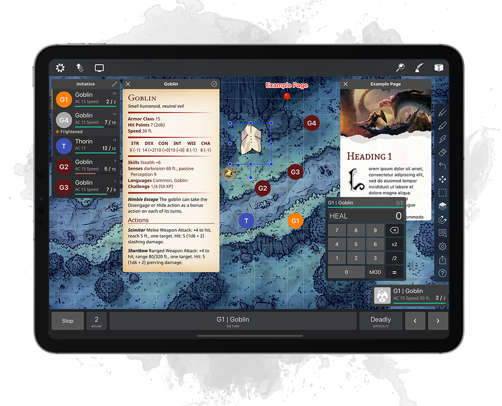

# EncounterPlus VTT iOS v4.11

Designed to help Dungeon Masters to run D&D 5E combat encounters more easily. You can track initiative, health, statistics, and conditions for various creatures. 

## Installation

## Documentation

Documentation can be found on https://help.encounter.plus. It is created automatically from this repository.

## Issues

Bugs, issues or enhancements are tracked in this repository using Issues section.
https://github.com/encounterplus/encounterplus/issues

## Discussion

